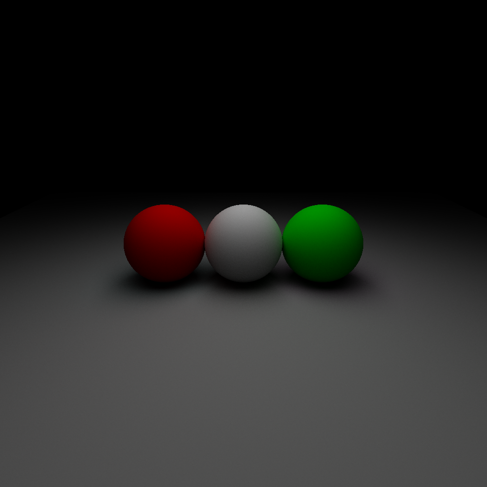
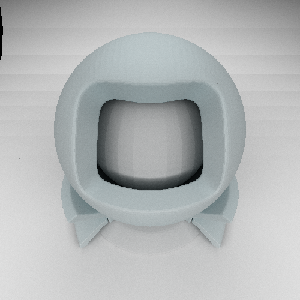

# Raytracer

Basic path tracer in C++.

## Examples




## Installation

### Dependencies
- CMake
- Conan

### Commands
```bash
$ mkdir build
$ cd build
$ conan install ..
$ cmake -DCMAKE_BUILD_TYPE=Release ..
$ make app
```

## Usage
Specify scene characteristics in a JSON file following the format in `scenes/`
and execute : 
```bash
$ ./app -f /path/to/scene/json -n number_of_spp
```

## Implemented
- Scene parametrisation with JSON
- OBJ and MTL files loadable
- Monte Carlo integrator
- BSDF : Lambertian diffuse, Fresnel dielectrics, Microfacets
- Axis based BVH
- Multithreaded computation of the image

## TODO
- Improve interface with OBJ and MTL (only load as diffuse for now)
- Improve BVH strategy
- Add BSDFs

## References
- [PBR book](https://www.pbr-book.org/)
- [Ray Tracing in One Weekend series](https://raytracing.github.io/)
- [Article on Microfacets BRDF](https://learnopengl.com/PBR/Theory)
- [Scratchapixel](https://www.scratchapixel.com)
- Fundamentals Of Computer Graphics, Peter Shirley, Steve Marschner
